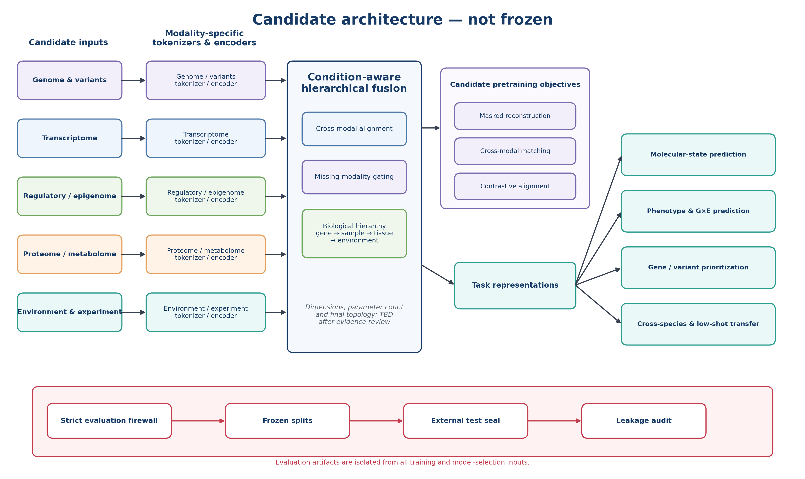
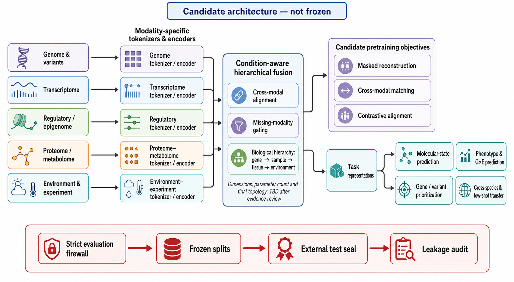

# 候选模型架构

更新日期：2026-07-16　状态：**CANDIDATE / NOT FROZEN**

## 1. 重要声明

当前只有候选架构蓝图，没有冻结的模型拓扑。层数、宽度、token数、参数量、作物、模态组合和任务路由均待阶段1—3证据决定；本页不把设计建议包装成已实现模型。

## 2. 两个架构图版本

### Python可复现权威图

该图由仓库脚本确定性生成，是当前概念拓扑的权威表达。

下载：[PNG](docs/assets/model_architecture_python.png) · [PDF](docs/assets/model_architecture_python.pdf) · [生成脚本](scripts/figures/render_public_figures.py)

### GPT视觉概念图

该图用于展示风格和阅读体验，不是结构合同；若与Python图冲突，以Python图和文字合同为准。

下载：[PNG](docs/assets/model_architecture_gpt.png) · [PDF](docs/assets/model_architecture_gpt.pdf)

## 3. 当前概念拓扑

### 输入与条件轴

五类候选输入分别进入自己的tokenizer/encoder：

1. Genome & variants（基因组与变异）；
2. Transcriptome（转录组）；
3. Regulatory / epigenome（调控与表观组）；
4. Proteome / metabolome（蛋白与代谢组）；
5. Environment & experiment（环境与实验设计）。

任何输入都不在编码前被无条件拼接。物种、种质、组织、时间、处理、site-year-trial、block、平台和批次需要作为显式条件轴进入建模与消融。

### 条件感知分层融合

中央候选模块包含三项必须比较的机制：

- cross-modal alignment（跨模态对齐）；
- missing-modality gating（缺失模态门控）；
- gene → sample → tissue → environment的生物学层级。

最终实现必须与简单拼接、early fusion、late fusion及去条件消融进行预算公平比较。

### 候选预训练目标

- masked reconstruction；
- cross-modal matching；
- contrastive alignment。

这些目标尚未冻结。只有真实数据配对、许可、任务价值和pilot稳定性支持时才保留；损失权重不得用formal test选择。

### 候选任务族

- molecular-state prediction（分子状态预测）；
- phenotype & G×E prediction（表型与基因型×环境预测）；
- gene / variant prioritization（基因/变异优先排序）；
- cross-species & low-shot transfer（跨物种与少样本迁移）。

具体任务必须在冻结前明确label版本、evaluable universe、独立统计单位、split最小单位、指标、强基线、最小有意义效应、seed和power。

## 4. 严格评估防火墙

外部测试不属于模型输入或训练流程。底部红色流程独立表示：

`Frozen splits → External test seal → Leakage audit → One-shot formal claim`

外测不得用于预训练、微调、归一化、插补、PCA、亲缘矩阵、图边、辅助目标、特征选择、阈值、checkpoint或ensemble选择。

## 5. 架构冻结前必须回答

| 决策 | 至少需要的证据 |
|---|---|
| 基本token单位 | 数据覆盖、计算成本、任务适配和跨版本稳定性 |
| 首版模态组合 | 许可、实体级配对、缺失率、互补信息和外测价值 |
| 融合位置 | early/late/hierarchical fusion消融 |
| 条件注入方式 | 显式条件化、分层交互和去条件对照 |
| 预训练目标 | validation pilot、负迁移检查和预算公平性 |
| 模型规模 | 至少2个规模×3个数据比例的缩放证据 |
| 任务头与路由 | 每任务冻结输入表征、标签和独立统计单位 |
| 参数预算 | 实际吞吐、显存、恢复、总GPU小时和强基线预算 |

## 6. 基线与消融

任何复杂架构必须至少比较：

- rrBLUP/GBLUP或任务适用的经典统计模型；
- XGBoost/LightGBM等强表格基线；
- 单模态模型；
- 简单拼接与early/late fusion；
- 同架构随机初始化；
- 去条件、去跨模态目标、去缺失门控和不同层级表示的消融。

如果复杂模型不能稳定优于这些基线，不得以参数规模、单seed或训练loss下降替代有效性证据。
