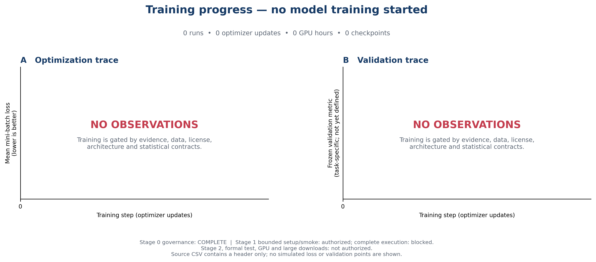
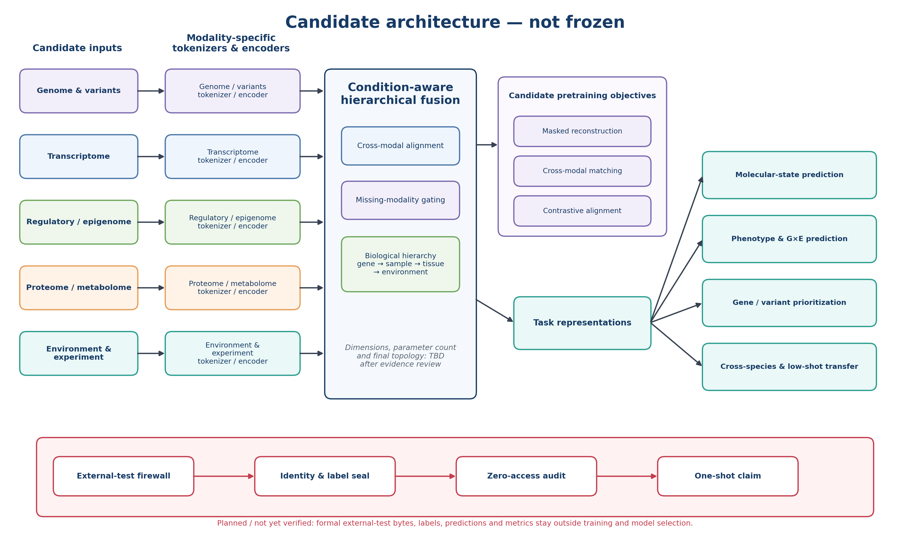
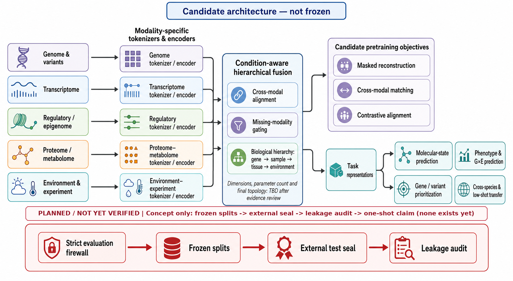

# Crop Multi-Omics Model

作物多组学预训练的可审计研究工程。目标不是先训练尽可能大的模型，而是严格检验：预训练和多模态表示能否在多任务、少样本、跨物种/环境及缺失模态场景中，相对强基线产生稳定、可重复的收益。

> 当前没有模型训练结果：0个训练run、0次参数更新、0 GPU小时、0个checkpoint。仓库不使用模拟曲线冒充进展。

## 第一次阅读建议

不了解机器学习或多组学时，建议按顺序阅读：

1. [研究计划](RESEARCH_PLAN.md)：项目为什么这样设计、十个阶段的输入/动作/产物/PASS/失败出口；
2. [研究进展](RESEARCH_PROGRESS.md)：真实完成了什么、证据是什么、还卡在哪里；
3. [候选模型架构](MODEL_ARCHITECTURE.md)：数据怎样进入模型、张量/mask怎样流动、怎样融合、更新参数、恢复checkpoint和隔离外测。

三份文件均包含术语白话解释、失败处理、维护规则和小白FAQ。

## 当前状态

| 项目 | 状态 | 白话解释 |
|---|---|---|
| 阶段0：治理、资源和终审 | **COMPLETE** | 研究规则和机器门禁已通过审查 |
| 阶段1：文献和现有模型核验 | GOVERNANCE READY / EXECUTION BLOCKED | 只允许实现、check-only和有界首屏smoke；完整分页、证据处理和最终receipt尚未实现 |
| 阶段2：数据身份、许可和配对 | BLOCKED | 尚未获准晋升真实数据 |
| 模型架构 | CANDIDATE / NOT FROZEN | 只有候选设计，层数和参数量未定 |
| 模型训练 | NOT STARTED | 没有loss、checkpoint或性能 |
| 正式外测、GPU和大下载 | NOT AUTHORIZED | 前置证据门禁未通过 |

“阶段0完成”不代表模型完成，只表示已经建立资源边界、数据/许可规则、统计合同、外测seal和防泄漏机制。

## 一图看懂当前进展



图中有标准坐标轴但没有数据点，因为训练尚未开始。下载：[PNG](docs/assets/figure_generations/6a0047ecb939a2b119aef75ef1d29d9bd1a4c9332e2452c7430d6829cd195e09/training_progress.png) · [PDF](docs/assets/figure_generations/6a0047ecb939a2b119aef75ef1d29d9bd1a4c9332e2452c7430d6829cd195e09/training_progress.pdf) · [源CSV](docs/assets/training_curve_source.csv) · [状态JSON](docs/assets/training_status.json)

## 候选模型架构

### Python可复现候选全集图



[PNG](docs/assets/figure_generations/6a0047ecb939a2b119aef75ef1d29d9bd1a4c9332e2452c7430d6829cd195e09/model_architecture_python.png) · [PDF](docs/assets/figure_generations/6a0047ecb939a2b119aef75ef1d29d9bd1a4c9332e2452c7430d6829cd195e09/model_architecture_python.pdf) · [生成脚本](scripts/figures/render_public_figures.py)

### GPT视觉概念图



[PNG](docs/assets/figure_generations/6a0047ecb939a2b119aef75ef1d29d9bd1a4c9332e2452c7430d6829cd195e09/model_architecture_gpt.png) · [PDF](docs/assets/figure_generations/6a0047ecb939a2b119aef75ef1d29d9bd1a4c9332e2452c7430d6829cd195e09/model_architecture_gpt.pdf)

两张图都用于解释候选设计空间，不代表模型已实现或拓扑已冻结；如图与状态表冲突，以文字状态表为准，未来以阶段4机器合同和冻结配置为可执行权威。

## 核心科学边界

- 旗舰作物、模态、token单位、headline任务、最终拓扑和参数量均未冻结；
- 同品种/同组织不自动等于同一样本，严格多组学配对需实体级证据；
- 许可未知的数据默认`NO_TRAIN`；
- split只允许`train / validation / formal_external_test`三种角色，不另设可反复查看的internal test；
- 预处理只在train拟合，validation只按预注册规则做模型选择，formal external不得选择超参数、checkpoint、阈值、loss或模型版本；
- 成功不是训练loss下降，而是相对随机初始化和强基线的多seed、配对、可重复增益；
- 相关性预测、候选排序和因果效应是不同结论层级；
- 只有多任务、少样本、迁移、缺失模态、缩放、严格外测和完整审计全部闭合后，才讨论“基础模型”。

## 十阶段路线

`阶段0治理 → 阶段1文献 → 阶段2数据 → 阶段3范围冻结 → 阶段4架构/统计 → 阶段5数据冻结 → 阶段6 MVP → 阶段7预训练 → 阶段8正式外测 → 阶段9论文与复现交付`

当前只允许推进阶段1。每阶段的输入、操作、产物、完成标准和失败处理见[研究计划](RESEARCH_PLAN.md)。

## 三份核心文档长期维护

本仓库不是一次性展示页，以下文件必须随项目持续更新：

| 文件 | 回答的问题 | 强制更新时机 |
|---|---|---|
| `RESEARCH_PLAN.md` | 准备怎么做、为什么、如何验收 | 范围、阶段、门禁、指标或停止规则变化 |
| `RESEARCH_PROGRESS.md` | 真实做了什么、证据/阻塞是什么 | 每个检索、数据、训练、评估里程碑或异常 |
| `MODEL_ARCHITECTURE.md` | 候选/冻结模型怎样工作 | 输入、模块、loss、规模、路由或状态变化 |

每次更新至少写清：日期/版本、状态变化、机器证据、真实结果、仍未知项、对下一阶段影响及图表是否同步。历史错误不得静默删除，必须在进展日志中更正。

## 图件复现

```bash
python scripts/figures/render_public_figures.py
```

脚本只读取仓库内公开源数据，不下载组学数据、不调用GPU、不生成模拟训练指标。当前renderer只支持“0观测”状态；它严格校验`training_status.json`全部展示字段，一旦CSV非空、状态矛盾或类型错误就fail closed。CLI先从稳定FD捕获自身字节并`exec`该私有快照，真正执行的renderer字节、输入hash和输出hash因此绑定同一代次；所有图先写入同文件系统staging并回读验证，发布前再逐字节复验实时输入。完整产物随后以no-replace方式写入内容寻址的不可变generation，generation内`READY`最后创建；顶层仅原子替换[当前generation指针](docs/assets/figure_current.json)。消费者必须先读指针，再读取它指向的[manifest与READY](docs/assets/figure_generations/6a0047ecb939a2b119aef75ef1d29d9bd1a4c9332e2452c7430d6829cd195e09/figure_manifest.json)，不得把固定文件名或跨generation文件拼成一次READY发布。GPT源图及发布PNG/PDF都在图内标明`PLANNED / NOT YET VERIFIED`，renderer还会强制叠加包含one-shot claim的状态横幅。第一条真实曲线发布前必须先实现并测试非空绘图分支，并让每个点绑定run、数据、split、配置、代码、seed、日志和checkpoint证据。

## 当前下一步

1. 阶段1合同`check-only`；
2. 一个开放数据库×query的真实检索smoke；
3. 核对导出、receipt和SHA-256；
4. 执行开放来源×12个query族；
5. 完成去重、版本链、双筛和关键模型四联核验；
6. 运行阶段1机器门禁；
7. 同步更新README和三份核心文档。

阶段1完成前，不启动数据晋升、GPU训练或大规模下载。