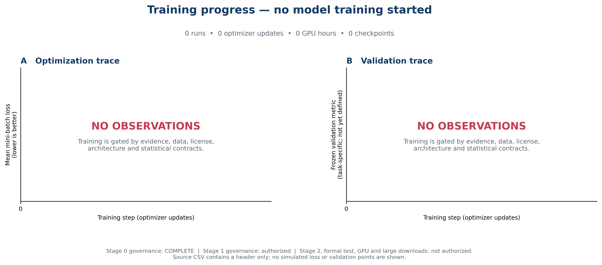

# 研究进展

更新日期：2026-07-16

## 1. 当前结论

阶段0已经完成机器终结验证：治理合同、资源审计、统计约束、外部测试seal、防泄漏和一次性formal claim协议均已建立并通过三路独立终审。

当前**没有启动模型训练**：训练run=0、optimizer update=0、GPU小时=0，因此没有loss、validation score、checkpoint或测试指标可报告。下图保留标准训练曲线坐标，但不绘制任何模拟点。

下载：[PNG](docs/assets/training_progress.png) · [PDF](docs/assets/training_progress.pdf) · [源CSV](docs/assets/training_curve_source.csv)

## 2. 阶段状态

| 工作流 | 状态 | 已完成证据 | 下一门禁 |
|---|---|---|---|
| 阶段0治理 | **COMPLETE** | R13三路终审PASS；91项冻结闭包零漂移；P0=0、P1=0 | 允许启动阶段1治理 |
| 文献检索 | NOT STARTED | 已预注册检索源、query族、重试和双筛协议 | 真实search receipt与双筛记录 |
| 数据目录 | BLOCKED | 已定义92列样本schema和数据身份层级 | 非空官方元数据与访问receipt |
| 许可核验 | BLOCKED | 已定义许可状态机和不可变receipt | 条款文本、证据定位和人工复核 |
| 多组学配对 | BLOCKED | 已定义P1—P4/PX和重复折叠规则 | 真实实体级配对证据 |
| 模型架构 | NOT FROZEN | 已形成候选设计空间 | 阶段1—3证据和决策矩阵 |
| 训练 | NOT STARTED | 无模型、无checkpoint、无训练日志 | 数据/许可/任务/架构/power全部冻结 |
| Formal test | NOT AUTHORIZED | 已建立seal/firewall/claim协议 | 预注册task、power、winner和外测seal |

## 3. 已完成工程工作

- 完成登录节点、BeeGFS、Slurm、环境、网络和计算节点轻量审计；
- 建立阶段1系统文献检索与阶段2元数据probe计划；
- 建立数据身份、许可、配对、预算、统计充分性和基础模型命名合同；
- 建立92列空样本manifest schema，明确随机化、block、重复嵌套和复合取样；
- 建立内容寻址稳定快照、外测seal、12类禁止consumer防泄漏、一次性formal claim；
- 完成R13终结：manifest SHA `1fcc6811af07b805d328c9bdf06b898e3af95a31c70eed0964e456809de40633`，三路终审均PASS；
- 完成56项canonical测试和非普通live entry安全回归。

## 4. 训练曲线数据说明

`docs/assets/training_curve_source.csv`目前只有表头，没有数据行。这是有意的：

- 不把资源审计作业当成模型训练；
- 不用模拟loss或validation score填充图表；
- 不把“阶段0完成”误写成“模型有效”；
- 后续每个真实点必须来自可追溯run、日志、配置、数据版本和checkpoint选择记录。

训练启动后，图A将显示mini-batch loss，图B将显示冻结validation指标，并标出仅由validation选择的checkpoint。正式测试指标不会写入训练曲线，也不会参与选择。

## 5. 当前阻塞

1. 尚无真实系统检索receipt、双筛记录或全文核验；
2. 尚无满足许可、身份、配对与重复折叠要求的非空训练数据；
3. headline任务、独立统计单位、最小有意义效应和power尚未冻结；
4. 最终架构、损失权重、参数规模和训练预算尚未冻结；
5. 外测seal、真实consumer输入和正式测试claim尚未生成。

## 6. 下一步

1. 执行阶段1开放数据库检索并完成双筛/代码/权重/许可核验；
2. 在阶段1证据基础上执行阶段2官方元数据、身份、许可和配对审计；
3. 用三方案决策矩阵冻结MVP任务、模态、单位、强基线和候选架构；
4. 通过power与资源gate后再启动可恢复的最小smoke和baseline；
5. 只有validation协议闭合后才形成第一条真实训练曲线。
